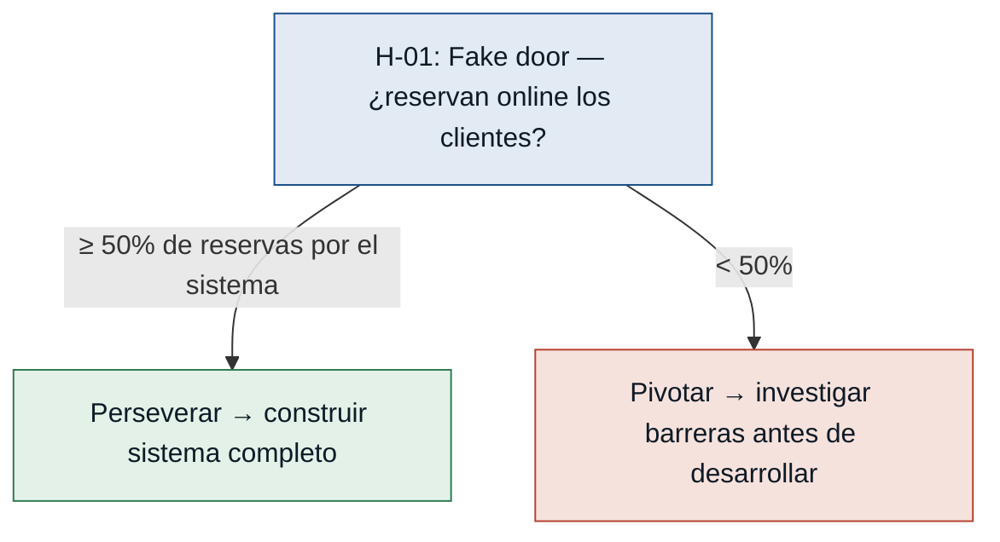
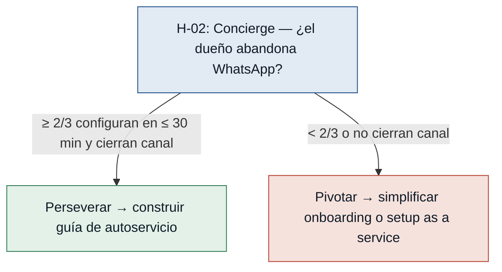
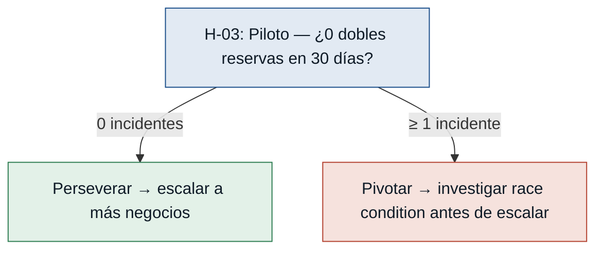
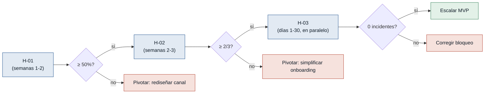

# Hipótesis y Experimentos — Wolverine

> Derivadas de los supuestos riesgosos del `mvp-canvas.md` del discovery
> `discoveries/wolverine`. Ordenadas de mayor a menor riesgo: primero se prueba
> lo que más puede tumbar el MVP. Formato: Test Card (hypothesis + experiment).

---

## Supuestos riesgosos identificados

Los tres supuestos del MVP Canvas que aún no están validados por evidencia:

| # | Supuesto | Riesgo | Por qué importa |
|---|---|---|---|
| H-01 | Los clientes adoptarán el canal de reserva en línea | Alto | Si no lo adoptan, el MVP no entrega valor; el dueño sigue en WhatsApp |
| H-02 | Los dueños configurarán el sistema y cerrarán el canal informal | Alto | Sin migración real del dueño, las dobles reservas persisten |
| H-03 | El bloqueo en tiempo real elimina las dobles reservas | Medio | Es técnicamente probable; el riesgo es bajo por el volumen del segmento |

---

## Test Cards

### [H-01] Adopción del cliente en el canal de reserva en línea — riesgo: alto

- **Supuesto a probar:** Los clientes de los negocios piloto usarán el canal de reserva en línea sin ayuda del dueño, en lugar de WhatsApp o llamadas.
- **Hipótesis:** Creemos que los clientes existentes realizarán su próxima reserva de forma autónoma por el sistema si el acceso al formulario es visible y el proceso toma menos de 3 minutos, porque el canal es más conveniente que esperar respuesta por WhatsApp.
- **Señal medible:** Porcentaje de reservas que ingresan por el sistema versus por canales informales (WhatsApp, llamada) durante los primeros 30 días piloto.
- **Criterio de éxito:** ≥ 50% de las reservas entran por el sistema en los primeros 30 días de operación piloto.
- **Experimento:** Fake door + Mago de Oz. Publicar un formulario de reserva simple (Google Forms) enlazado desde el perfil de WhatsApp/Instagram del negocio, sin construir el sistema completo. El dueño procesa las solicitudes manualmente detrás de bambalinas y confirma por el mismo canal.
- **Caja de tiempo/costo:** 2 semanas de operación + 1 semana de análisis. Costo ≈ 0 (solo el tiempo del dueño y el formulario gratuito).
- **Regla de decisión:** Si pasa (≥ 50% por el sistema) → construir el sistema completo con bloqueo automático. Si falla (< 50%) → investigar barreras (fricción del formulario, desconfianza, desconocimiento del canal) y pivotar el flujo antes de invertir en desarrollo.

---

### [H-02] Disposición del dueño a migrar y cerrar el canal informal — riesgo: alto

- **Supuesto a probar:** Los dueños están dispuestos a configurar el sistema con su oferta de servicios y a dejar de aceptar reservas por WhatsApp, cambiando un hábito establecido.
- **Hipótesis:** Creemos que el dueño de negocio piloto completará la configuración inicial y redirigirá a sus clientes al nuevo canal si el onboarding toma menos de 30 minutos y el sistema resuelve de inmediato el problema de dobles reservas, porque el dolor actual es suficientemente grande para justificar el cambio de hábito.
- **Señal medible:** Tiempo hasta primera configuración operativa, y número de negocios piloto que cierran o redirigen el canal de WhatsApp para reservas en los primeros 7 días.
- **Criterio de éxito:** ≥ 2 de 3 negocios piloto completan el onboarding en ≤ 30 minutos y redirigen su canal de reservas en los primeros 7 días.
- **Experimento:** Concierge. Acompañar en persona a cada dueño en la configuración inicial del prototipo, cronometrar el tiempo total y registrar los puntos de fricción. Seguimiento a los 7 días para verificar si el canal de WhatsApp está cerrado o redirigido ("reserva aquí → [enlace]").
- **Caja de tiempo/costo:** 1 semana por negocio piloto (configuración + seguimiento). Costo 0 de herramienta.
- **Regla de decisión:** Si pasa (≥ 2/3 en ≤ 30 min y cierran canal) → el onboarding es viable; construir guía de autoservicio. Si falla → pivotar el flujo de onboarding: simplificar la configuración o descartar el autoservicio y ofrecer setup as a service para el lanzamiento.

---

### [H-03] Efectividad del bloqueo automático bajo demanda concurrente — riesgo: medio

- **Supuesto a probar:** El bloqueo automático en tiempo real elimina las dobles reservas incluso cuando dos clientes solicitan el mismo espacio de forma simultánea.
- **Hipótesis:** Creemos que el mecanismo de bloqueo resultará en 0 incidentes de doble reserva durante el piloto en negocios pequeños, porque el volumen de solicitudes simultáneas en este segmento rara vez supera 2-3 por franja horaria.
- **Señal medible:** Número de incidentes de doble reserva reportados por los dueños piloto durante 30 días de operación del sistema.
- **Criterio de éxito:** 0 incidentes de doble reserva en los 30 días del piloto.
- **Experimento:** Prototipo en producción. Desplegar el sistema en 2-3 negocios reales durante 30 días y pedir a los dueños que reporten cualquier doble reserva. Corre en paralelo con H-01 y H-02, sin costo adicional ni ventana de tiempo propia.
- **Caja de tiempo/costo:** 30 días de operación piloto (absorbida en el mismo piloto de H-01). Costo marginal 0.
- **Regla de decisión:** Si pasa (0 incidentes) → el bloqueo funciona para el volumen actual; no priorizar optimización técnica antes de escalar. Si falla (≥ 1 incidente) → investigar la causa (race condition, latencia, error de interfaz) y corregir antes de ampliar la base de negocios.

---

## Secuencia de aprendizaje

Los tres experimentos se pueden solapar en el tiempo porque comparten el mismo
piloto de 2-4 semanas con 2-3 negocios reales. El orden de decisión, sin embargo,
es en cascada: **no construir el sistema completo** hasta validar H-01 (adopción
del cliente); **no invertir en onboarding de autoservicio** hasta validar H-02
(disposición del dueño); H-03 se responde de forma gratuita durante el mismo piloto.

