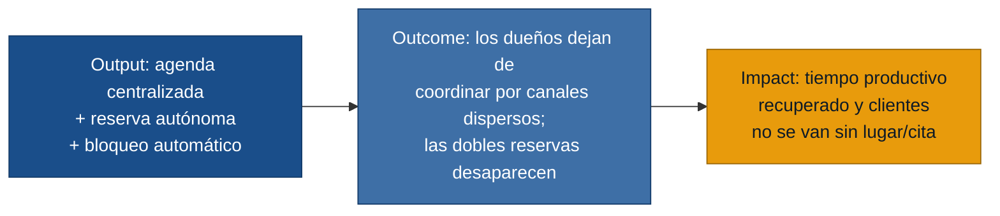

# MVP Canvas — Wolverine

> Derivado de `personas.md`, `requisitos.md` y `user-stories.md` del discovery
> `discoveries/wolverine`. Sin invención: cada bloque cita su evidencia.

---

## Cadena de valor

---

## Canvas

| Bloque | Contenido |
|---|---|
| **Propuesta de valor** | Una agenda centralizada donde los clientes reservan de forma autónoma y el sistema bloquea cada espacio en el acto, eliminando las dobles reservas y el tiempo invertido en coordinar por WhatsApp, Instagram o llamadas. |
| **Segmento de usuarios** | Dueños de negocios de servicios pequeños (bares, spas, técnicos independientes) que gestionan su agenda por canales informales y sufren pérdidas directas por sobreposición de reservas o tiempo productivo consumido en organización. |
| **Funcionalidades mínimas** | 1. Vista de disponibilidad en tiempo real (US-01). 2. Formulario de reserva autónoma para el cliente (US-02). 3. Configuración de servicios con duración variable (US-03). 4. Bloqueo automático del espacio/turno al confirmar (US-04). |
| **Resultado esperado (outcome)** | Los dueños dejan de monitorear múltiples canales para recibir reservas; los clientes reservan solos; las dobles reservas dejan de ocurrir. |
| **Métrica de éxito** | Al cabo de 30 días piloto: (1) ≥ 70% de las reservas entran por el sistema, no por WhatsApp/llamada; (2) 0 dobles reservas reportadas en los negocios piloto. |
| **Riesgos / supuestos** | (a) Los clientes adoptarán el canal de reserva en línea sin fricción adicional (no validado). (b) Los dueños configurarán su capacidad y servicios en el sistema al inicio (no validado). (c) El bloqueo en tiempo real eliminará las sobreposiciones incluso bajo demanda alta concurrente (supuesto técnico). |
| **Fuera de alcance (por ahora)** | Ver bloque detallado abajo. |

---

## Métricas de éxito — prueba ácida

| Métrica | Por qué no es de vanidad |
|---|---|
| ≥ 70% de reservas por el sistema (30 días) | Si sube, el dueño puede decidir cerrar el canal de WhatsApp o reasignar el tiempo que le dedicaba. Decisión de negocio directa. |
| 0 dobles reservas en el piloto | Si llega a 0, el dueño puede decidir escalar el sistema a más servicios o sucursales. Decisión de negocio directa. |

---

## Fuera de alcance por ahora

| Qué | Por qué espera |
|---|---|
| Recordatorios automáticos a clientes (US-05 / R-04) | Reduce el impacto de los no-shows, pero no es la causa raíz de las dobles reservas. Entra en la segunda iteración si el MVP valida adopción. Fuente: `dueno-spa.md`. |
| Gestión avanzada de cancelaciones y reagendamientos (US-06 / R-05) | Complejiza el flujo antes de validar que los clientes usan el nuevo canal para reservas originales. Fuente: `tecnico-piscinas.md`, `dueno-spa.md`. |
| Integración con canales existentes (WhatsApp, Instagram) | Alta complejidad técnica. Primero validar que los clientes adoptan el canal nuevo; si lo adoptan, la integración pierde urgencia. |
| Panel de reportes / analytics | Sin evidencia de que los entrevistados lo necesiten ahora. Sin fuente en entrevistas → no entra al MVP. |

---

## Notas de priorización

Los dolores que justifican el MVP aparecen en **al menos dos de los tres perfiles**
entrevistados:

- Dobles reservas / sobreposición → dueño de bar + dueña de spa (`dueno-bar.md`,
  `dueno-spa.md`)
- Reserva autónoma del cliente → dueño de bar + técnico (`dueno-bar.md`,
  `tecnico-piscinas.md`)
- Agenda dispersa / falta de vista centralizada → dueño de bar + técnico

El no-show y los recordatorios solo aparecen en un perfil (spa), por lo que quedan
fuera del núcleo del MVP aunque son dolores reales y válidos.
