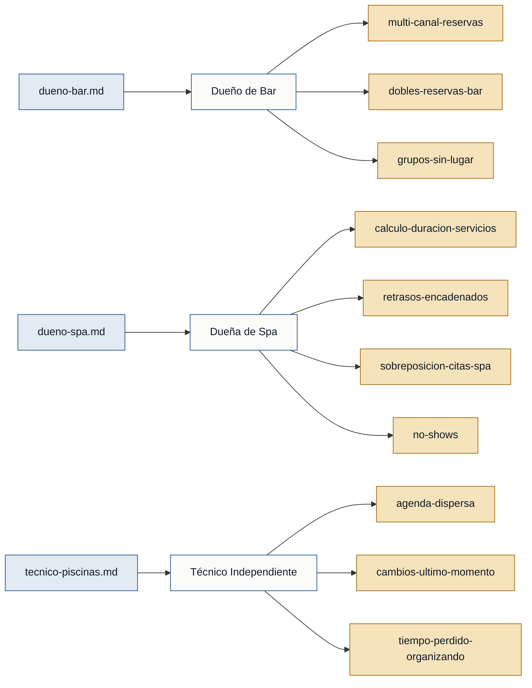

# Personas y Stakeholders — Wolverine

> Generado desde las entrevistas de `discoveries/wolverine/interviews/`.
> Toda afirmación cita su archivo fuente.

---

## Personas

### Dueño de Negocio de Bar — dueño de bar

- **Contexto:** Propietario de un bar que recibe reservas de mesas por múltiples canales informales (WhatsApp, Instagram, llamadas telefónicas, meseros).
- **Objetivo principal:** Centralizar la disponibilidad de mesas en un solo lugar y permitir que los clientes reserven de forma autónoma, sin que él deba monitorear varias conversaciones.
- **Dolores:**
  - Reservas que llegan por canales dispersos y no integrados, lo que impide ver la disponibilidad real en tiempo real. (`dueno-bar.md`)
  - Dobles reservas: se promete la misma mesa a dos clientes distintos por falta de visibilidad centralizada. (`dueno-bar.md`)
  - Grupos grandes que llegan sin lugar asignado, obligando a improvisar y generando clientes insatisfechos. (`dueno-bar.md`)
- **Respaldo:** `primera mano` — `dueno-bar.md`

---

### Dueña de Negocio de Spa — dueña de spa

- **Contexto:** Propietaria de un spa que gestiona citas de múltiples servicios con duraciones variables, usando una agenda manual.
- **Objetivo principal:** Que el sistema calcule automáticamente los horarios disponibles según la duración de cada servicio, y que envíe recordatorios a los clientes para reducir no-shows.
- **Dolores:**
  - Error en el cálculo de espacios entre citas porque los servicios tienen duraciones distintas. (`dueno-spa.md`)
  - Retrasos encadenados cuando una cita se extiende más de lo previsto, afectando todas las siguientes. (`dueno-spa.md`)
  - Sobreposición de reservas: acepta citas en horarios ya comprometidos. (`dueno-spa.md`)
  - No-shows: clientes que no aparecen a su cita sin avisar, dejando tiempo muerto no recuperable. (`dueno-spa.md`)
- **Respaldo:** `primera mano` — `dueno-spa.md`

---

### Técnico de Servicio Independiente — técnico de limpieza de piscinas

- **Contexto:** Técnico independiente que realiza visitas domiciliarias (limpieza de piscinas) y gestiona su agenda entre WhatsApp y el calendario del celular.
- **Objetivo principal:** Que los clientes vean su disponibilidad y puedan agendar visitas directamente, para liberar el tiempo que hoy gasta reorganizando la agenda manualmente.
- **Dolores:**
  - Agenda dispersa entre WhatsApp y calendario personal: funciona con pocos clientes pero pierde el control cuando la semana se llena. (`tecnico-piscinas.md`)
  - Cambios de último momento (cancelaciones, adelantos, nuevas solicitudes) que obligan a reorganizar todo manualmente. (`tecnico-piscinas.md`)
  - Tiempo productivo consumido en organización de agenda en lugar de en el trabajo técnico. (`tecnico-piscinas.md`)
- **Respaldo:** `primera mano` — `tecnico-piscinas.md`

---

## Stakeholders

### Cliente final (quien hace la reserva)

- **Interés en el sistema:** Poder reservar una mesa, cita o visita técnica de forma autónoma, recibir confirmación y recordatorios, y no llegar a encontrar su lugar ocupado o su cita sin efecto.
- **Fuente:** Mencionado en las tres entrevistas (`dueno-bar.md`, `dueno-spa.md`, `tecnico-piscinas.md`). **No hay entrevista de primera mano de este rol.**

---

## Mapa de trazabilidad

> **Verde** = respaldo de primera mano · **Ámbar** = solo referenciada.
> Las tres personas tienen entrevista propia (verde). El cliente final (stakeholder) solo está referenciado: sin entrevista de primera mano, no puede sustentar un MVP.
